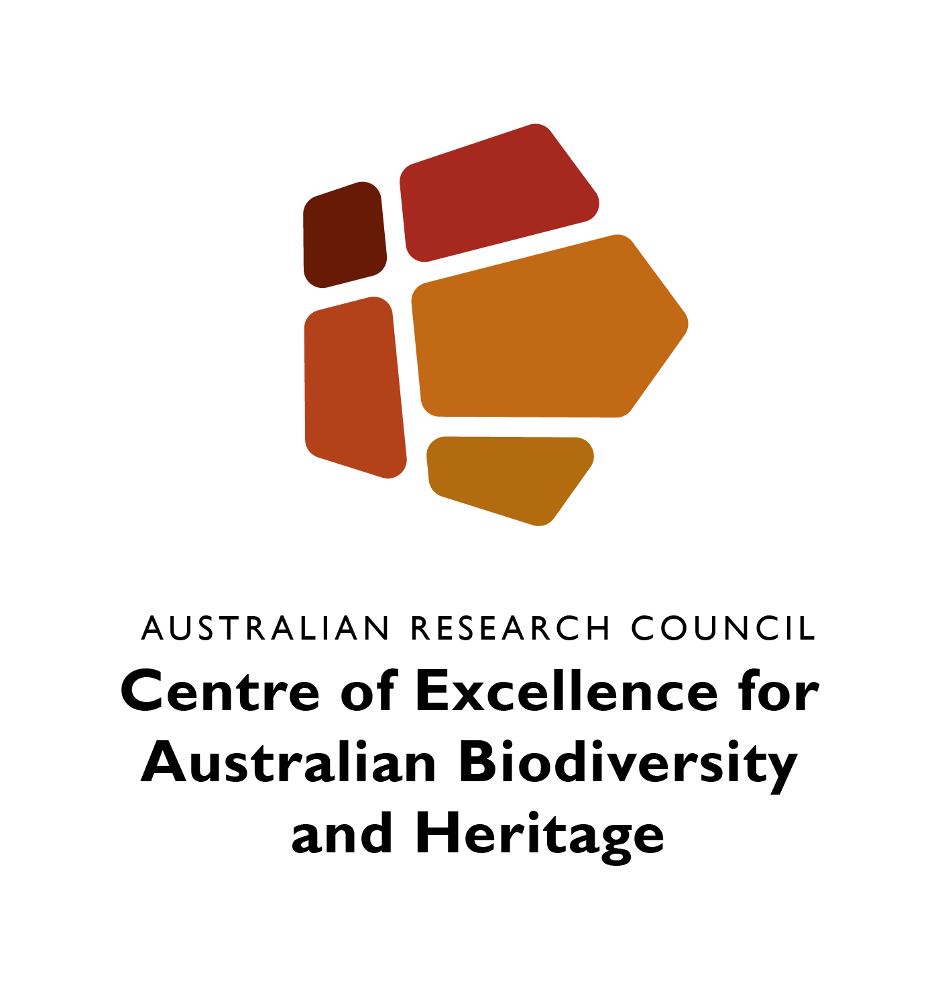

# OCTOPUS

OCTOPUS is an OGC-compliant, web-enabled database that allow users to visualise, query, and download geochronological data along with associated geospatial (vector and raster) data layers.

It is based on open source software and allows for various levels of integration. For example, data stored in the database can be visualised via a custom web interface but also via desktop GIS applications that support OGC data-access protocols. OCTOPUS can also directly export data to various formats, including <a href="https://developers.google.com/kml/documentation/kml_tut">Google Earth KLM</a> and <a href="https://www.esri.com/Library/Whitepapers/Pdfs/Shapefile.pdf">ESRI shapefile</a>.

Access the map-browser version of OCTOPUS <a href="https://earth.uow.edu.au/">here</a>, the downloadable data portal <a href="http://octopus.x.ice-d.org">here</a>, or the <em>AuScope Discovery</em> portal <a href="http://portal.auscope.org.au">here</a>.

OCTOPUS was made possible via a grant from the <a href="https://www.ands.org.au">Australian National Data Service</a>, and the project has also received (and continues to receive) substantial in-kind support from the University of Wollongong's <a href="https://www.uow.edu.au/its/">Information Technology Services</a> unit. The database was officially launched in March 2018, with an associated <a href="https://doi.org/10.5194/essd-10-2123-2018">discussion paper</a> published in <a href="https://www.earth-system-science-data.net"><em>Earth System Science Data</em></a> (see Reference below for detail). Over the next five years, OCTOPUS will be supported by the ARC <a href="http://epicaustralia.org.au">Centre of Excellence for Australian Biodiversity and Heritage</a>, resulting in an upgrade to the web interface, and additional geochronological data collections.

## References
Codilean, A.T., Munack, H., Saktura, W.M., Cohen, T.J., Jacobs, Z., Ulm, S., Hesse, P.P., Heyman, J., Peters, K.J., Williams, A.N., Saktura, R.B.K., Rui, X., Chishiro-Dennelly, K., Panta, A. 2022. <a href="https://doi.org/10.5194/essd-14-3695-2022">OCTOPUS database (v.2)</a>. <em>Earth System Science Data</em> 14: 3695-3713

<a href="https://github.com/codilean">Codilean, AT</a>, H Munack, TJ Cohen, WM Saktura, A Gray, SM Mudd. 2018. <a href="https://doi.org/10.5194/essd-10-2123-2018">OCTOPUS: an open cosmogenic isotope and luminescence database</a>. <em>Earth System Science Data</em> 10: 2123–2139

